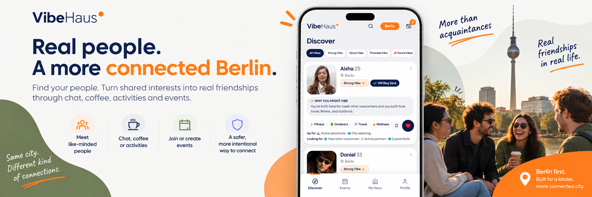

[](assets/VibeHaus-Banner.png)

# ✨ VibeHaus — AI Friendship Discovery

### AI Product Management Capstone | Berlin

An AI-powered friendship-discovery product designed to help **expats, newcomers, and locals in Berlin** find people they genuinely connect with — and turn those connections into real friendships.

VibeHaus goes beyond profile browsing by combining **personal fit, mutual intent, explained recommendations, and real-world activities**. Users can discover compatible people, understand *why they might vibe*, become **Vibemates** through mutual consent, and move naturally toward chat, coffee, activities, and events.

Created as part of the **Ironhack AI Product Management Bootcamp**

[](https://vibehaus-expats-connect.lovable.app/)
[](docs/VibeHaus-PRD.pdf)
[](docs/VibeHaus-Discovery-Report.pdf)
[](docs/VibeHaus-MVP-Scope-Backlog-&-Roadmap.pdf)
[](docs/VibeHaus-Architecture-&-Technical-Overview.pdf)
[](deck/VibeHaus-Slides-Deck.pdf)

---

# 📖 Overview

Making friends in a new city is not necessarily difficult because there are too few people to meet. The bigger challenge is finding people you **genuinely click with** — and feeling comfortable enough to make the first move.

VibeHaus explores a **fit-first approach to friendship discovery**. Instead of focusing primarily on swiping, proximity, or large social events, it recommends potential friends based on **interests, personality, social energy, friendship intent, and other compatibility signals**.

Each recommendation includes an explanation of **Why You Might Vibe**, helping users understand the reasoning behind the match rather than relying on an unexplained compatibility score.

Once someone feels like a good fit, the journey is designed around progressive mutual consent:

> **Discover → Understand the Vibe → Send Request → Become Vibemates → Chat → Make an IRL Plan**

VibeHaus also supports activity-led connection through **Coffee Vibes, Activity Vibes, and community Events**, helping users move from online discovery toward real-world friendship.

---

# 🚀 Project at a Glance

| | |
|---|---|
| ✨ **Product** | VibeHaus |
| 🎯 **Objective** | Help people find better-fit friendships and move from discovery to meaningful real-world connection |
| 👥 **Primary Audience** | Expats and newcomers in Berlin, while remaining open to locals seeking deeper friendships |
| 📍 **Initial Market** | Berlin, Germany |
| 📱 **Platform** | Mobile-first responsive web app |
| 🤖 **Product Type** | AI-powered Friendship Discovery & Social Connection |
| 🧠 **Core Approach** | Fit-first matching · Explained recommendations · Mutual consent · Activity-led connection |
| 📦 **MVP** | Onboarding · Vibe Match Discovery · Explained Matching · Vibemate Requests · My Haus · Chat · IRL Plans · Events · Calendar · Safety |
| ✨ **Stretch** | Mr. Vibe AI Assistant |
| 🛠️ **My Role** | Product Discovery · User Research · Competitive Analysis · Product Strategy · PRD · MVP Scoping · Backlog · Story Mapping · Roadmap · Responsible AI · Technical Architecture · Prototype · Success Metrics |
| 🧪 **Prototype / Build** | Lovable · React · Supabase |
| 📊 **North Star** | Confirmed IRL Connection Rate |
| 🚀 **Future Vision** | Berlin scale-up · VibeHaus+ · Hosted Experiences · Multi-city expansion · Native mobile experience |

---

# ✨ VibeHaus

### Your vibe. Your people. Your city.

**VibeHaus** is an AI-powered friendship-discovery product designed to help **expats, newcomers, and locals in Berlin** find people they genuinely connect with — and turn those connections into real friendships through chat, coffee, activities, and events.

🔗 **[Try the Live App](https://vibehaus-expats-connect.lovable.app/)**

**AI Product Management Capstone · Sakshi Gaur**

---

## 🌱 The Problem

Making friends as an adult is difficult — especially after moving to a new city or country.

The problem is not necessarily a lack of people. It is finding people you genuinely **fit with**, combined with the awkwardness of making the first move.

Early VibeHaus discovery highlighted three key challenges:

- People want **depth, not just access** to more people.
- Finding people with the right personality, interests, and social energy is difficult.
- Reaching out first can feel awkward or even "clingy."

### How Might We

> **How might we help newcomers in Berlin find people they genuinely click with — and reach out without fear of being clingy — so that casual meetings become real friendships?**

📄 **[View Discovery Report](docs/VibeHaus-Discovery-Report.pdf)**

---

## 💡 The Solution

VibeHaus takes a **fit-first, consent-led, and event-enabled** approach to friendship discovery.

Instead of relying mainly on swiping, proximity, or large events, VibeHaus recommends people based on signals such as:

- Interests
- Personality
- Social energy
- Friendship intent
- Connection preferences

Each recommendation includes a **Vibe Strength** and a simple **"Why You Might Vibe"** explanation.

The connection flow is designed around mutual consent:

**Discover → Like → Vibemate Request → Mutual Acceptance → Chat → Coffee / Activity**

A private Like does not contact the other person. Users only become **Vibemates** after a request is mutually accepted.

---

## ✨ Core MVP Features

| Feature | What it does |
|---|---|
| 🧭 **Vibe Match Discovery** | Personality-first friendship recommendations |
| ✨ **Explained Matching** | Shows Vibe Strength and "Why You Might Vibe" |
| ❤️ **Vibemate Requests** | Mutual-consent connection flow |
| 🏠 **My Haus** | Vibemates, requests, and chats in one place |
| 💬 **Chat** | Unlocks after becoming Vibemates |
| ☕ **Coffee & Activity Vibes** | Move conversations toward real-world plans |
| 🎟️ **Events / Vibes** | Discover, create, and join public or private activities |
| 📅 **Calendar** | View confirmed and pending plans |
| 🛡️ **Safety Controls** | Block, Report, and Remove Vibemate |
| 🤖 **Mr. Vibe — Stretch** | Activity-based friendship discovery assistant |

📄 **[View Product Requirements Document](docs/VibeHaus-PRD.pdf)**  
📄 **[View MVP Scope, Backlog & Roadmap](docs/VibeHaus-MVP-Scope-Backlog-&-Roadmap.pdf)**

---

## 🔄 Core User Journey

**Awareness → Onboarding → Discover → Connect → Engage**

A user signs up, sets their interests and friendship intent, discovers compatible Vibe Matches, understands **why they might vibe**, sends a Vibemate Request, and — after mutual acceptance — can Chat, suggest Coffee, or plan an Activity together.


---

## 🆚 Competitive Positioning

VibeHaus was explored alongside **Bumble BFF, Meetup, Timeleft, and InterNations**.

While these products tend to be swipe-first, event-first, or community-first, VibeHaus combines:

> **High personal fit + High mutual intent + Events + Expat-first discovery**

Its differentiation is not simply AI matching. It is the combination of **fit, explained recommendations, mutual consent, and multiple paths toward real-world friendship**.


📄 **[See Full Competitive Research](docs/VibeHaus-Discovery-Report.pdf)**

---

## 🗺️ Product Roadmap

The roadmap follows an evidence-led progression:

**MVP → Validate → Scale → Monetize → Future Opportunities**

### 🔵 Phase 1 — MVP
Prove the fit-first, mutual-consent connection loop through an Internal Alpha.

### ⚪ Phase 2 — Validate
Closed Berlin Beta with approximately **50–100 invited users** to test trust, retention, match quality, and real-world connection.

### 🟠 Phase 3 — Scale
Gradual soft-launch waves leading toward a Berlin public launch.

### 🟢 Phase 4 — Monetize
Explore **VibeHaus+**, Hosted Experiences, premium features, and payments only after the core friendship experience demonstrates value.

### 🔭 Future
Multi-city expansion, newcomer/community features, and native mobile experiences.


📄 **[View Full Roadmap & Backlog](docs/VibeHaus-MVP-Scope-Backlog-&-Roadmap.pdf)**

---

## 🏗️ Technical Architecture

The current MVP is a **mobile-first responsive web app**.

| Layer | Current Approach |
|---|---|
| **Frontend** | React |
| **Backend & Database** | Supabase |
| **Authentication** | Supabase Auth |
| **Build & Deployment** | Lovable |
| **Matching** | Rule / attribute-based compatibility logic |
| **Generative AI** | Match explanations, Icebreakers & Mr. Vibe |
| **Future Platform** | Native iOS & Android |

The matching layer determines compatibility, while the LLM helps explain **why two people might vibe**. AI supports the recommendation experience rather than making friendship decisions for the user.

📄 **[View Architecture & Technical Overview](docs/VibeHaus-Architecture-&-Technical-Overview.pdf)**

---

## 🤖 Responsible AI

VibeHaus is designed around **transparent AI and human control**.

- AI recommendations support decisions rather than making them.
- Protected attributes are not used for compatibility scoring.
- Recommendations include understandable explanations.
- Users control whether they Like, Save, Skip, or send a Vibemate Request.
- Contact requires mutual acceptance.
- Mr. Vibe uses controlled interactions and safe fallbacks.
- Core safety functionality remains available to all users.

> **AI explains and assists. The user decides.**

📄 **[View AI Responsibility Statement](docs/VibeHaus-AI-Responsibility-Statement.pdf)**

---

## 📊 Measuring Success

VibeHaus focuses on whether digital introductions turn into **real-world connection**, rather than maximizing time spent in the app.

### North Star Metric

**Confirmed IRL Connection Rate**

> The percentage of accepted Vibemate connections that progress to an accepted Coffee or Activity Vibe.

Other validation metrics include:

- Onboarding Activation Rate
- Vibemate Request Rate
- Vibemate Acceptance Rate
- D7 Retention
- D30 Retention
- Signup → Confirmed IRL Plan funnel

> **Note:** Dashboard values are simulated capstone data used to demonstrate the measurement and decision framework.

### MVP Validation Dashboard


### Conversion Funnel


📄 **[View Launch Plan & Monitoring Dashboard](docs/VibeHaus-Launch-Plan-&-Monitoring-Dashboard.pdf)**

---

## 🎨 Design & Product Voice

VibeHaus uses a warm but modern visual system built around **navy, orange, olive, and off-white**.

The product voice is:

> **Warm · Honest · Low-pressure**

The experience deliberately avoids romantic language, fake urgency, guilt-driven notifications, and unexplained AI outputs.

📄 **[View Design System](docs/VibeHaus-Design-System.pdf)**  
📄 **[View Copywriting Guide](docs/VibeHaus-Copywriting.pdf)**

---

## 📁 Project Documentation

| Document | Description |
|---|---|
| 📄 **[Discovery Report](docs/VibeHaus-Discovery-Report.pdf)** | Research, problem framing, user insights & competitors |
| 📄 **[Product Requirements Document](docs/VibeHaus-PRD.pdf)** | Product requirements, scope & success metrics |
| 📄 **[MVP Scope, Backlog & Roadmap](docs/VibeHaus-MVP-Scope-Backlog-&-Roadmap.pdf)** | Epics, stories, prioritization & roadmap |
| 📄 **[Launch Plan & Dashboard](docs/VibeHaus-Launch-Plan-&-Monitoring-Dashboard.pdf)** | Launch strategy, KPIs & funnel |
| 📄 **[AI Responsibility Statement](docs/VibeHaus-AI-Responsibility-Statement.pdf)** | Responsible AI approach & guardrails |
| 📄 **[Architecture Overview](docs/VibeHaus-Architecture-&-Technical-Overview.pdf)** | Technical architecture & AI implementation |
| 📄 **[Design System](docs/VibeHaus-Design-System.pdf)** | Brand, UI components & interaction patterns |
| 📄 **[Copywriting Guide](docs/VibeHaus-Copywriting.pdf)** | Product voice & UX copy |

---

## 📂 Repository Structure

```text
VibeHaus/
│
├── README.md
│
├── docs/
│   ├── VibeHaus-PRD.pdf
│   ├── VibeHaus-Discovery-Report.pdf
│   ├── VibeHaus-MVP-Scope-Backlog-&-Roadmap.pdf
│   ├── VibeHaus-Launch-Plan-&-Monitoring-Dashboard.pdf
│   ├── VibeHaus-AI-Responsibility-Statement.pdf
│   ├── VibeHaus-Architecture-&-Technical-Overview.pdf
│   ├── VibeHaus-Design-System.pdf
│   └── VibeHaus-Copywriting.pdf
│
├── assets/
│   ├── vibehaus-logo-wordmark.png
│   ├── vibehaus-logo-icon.png
│   ├── vibehaus-competitive-analysis.png
│   ├── vibehaus-user-journey.png
│   ├── vibehaus-story-map.png
│   ├── VibeHaus-Roadmap.png
│   ├── Looker-Dashboard-01.png
│   └── Looker-Dashboard-02.png
│
└── deck/
    └── VibeHaus-Slides-Deck.pptx
```

---

## 🚀 Product Strategy

The strategy behind VibeHaus is simple:

> ### **Prove the fit. Protect the experience. Then scale.**

Berlin is the starting point. Expansion and monetization come only after the core friendship experience demonstrates that it can help people move from **discovery → mutual connection → real-world plans**.

---

## 👩‍💻 About the Project

**VibeHaus** was created by **Sakshi Gaur** as an **AI Product Management Capstone**.

The project covers the end-to-end product process:

**Discovery → Product Strategy → PRD → Prioritization → Backlog → Story Mapping → MVP → Responsible AI → Analytics → Launch Strategy → Roadmap**

### 🔗 [Try the Live VibeHaus App](https://vibehaus-expats-connect.lovable.app/)

---

**VibeHaus** · *Your vibe. Your people. Your city.*
